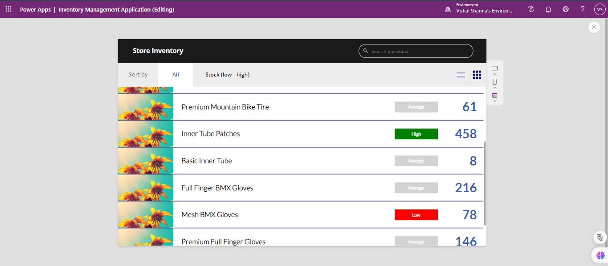
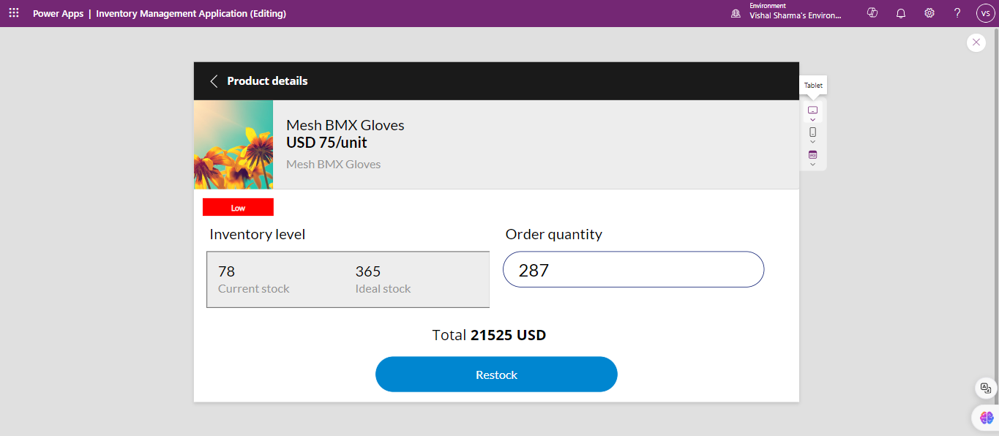
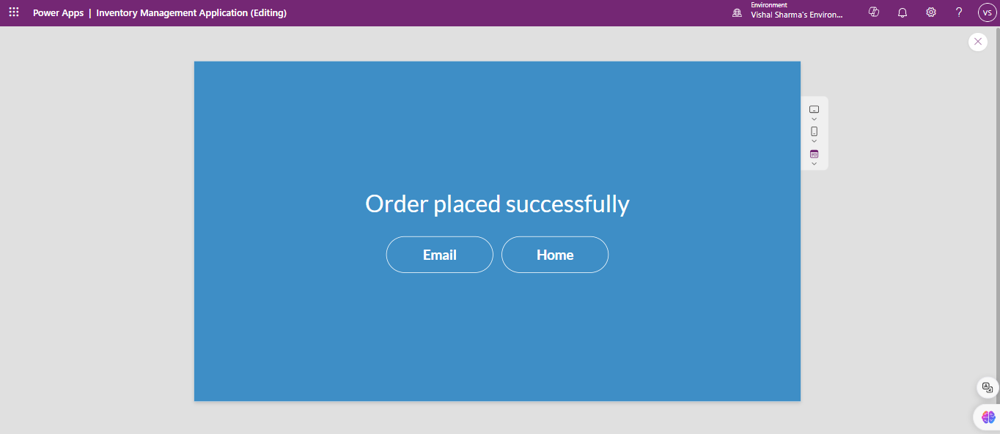
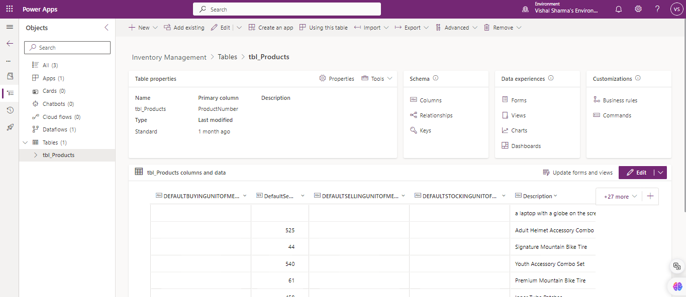
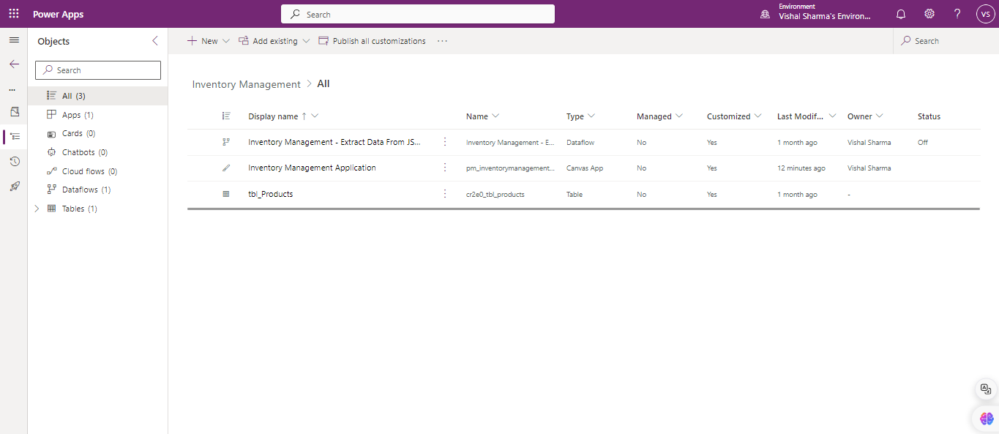

# Inventory Management Solution

This is a Power Apps-based Inventory Management solution designed to track products, manage stock levels, and streamline the restocking process. The app integrates with **Dataverse** for data storage and utilizes a **JSON to Table dataflow** for easy data import and transformation.

## App Features

- **Home Screen:** Displays a list of all products and their stock levels.
- **Product Detail Screen:** Allows users to view product details and restock inventory.
- **Success Screen:** Confirms that products have been restocked successfully.
- **Dataverse Integration:** Stores all product data and stock information.
- **JSON to Table Dataflow:** Imports and transforms product data from JSON into a Dataverse table.

## App Screenshots

### Home Screen

_Displays a list of products with their current stock levels._

### Product Detail Screen

_Shows product details and allows users to restock inventory._

### Success Screen

_Displays a confirmation message after successfully restocking a product._

### Dataverse Table Screenshot

_This screenshot shows the structure of the Dataverse table that stores the product information._

## JSON to Table Dataflow

The solution uses a **JSON to Table** dataflow to import and transform product data from a JSON file into the Dataverse table.

### Solution Screenshot

_This screenshot shows the complete solution structure, including all components._
